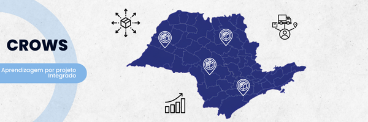
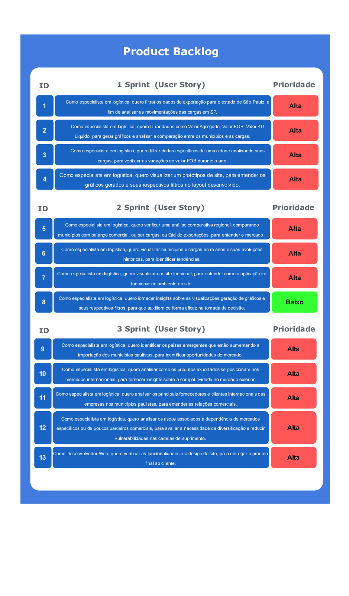

# **API 1 SEMESTRE - Crows**

## Índice
1. [Tecnologias Utilizadas](#-tecnologias-utilizadas)
2. [Objetivo do Projeto](#-objetivo-do-projeto)
3. [Visão do Produto](#-visão-do-produto)
4. [Metodologia](#%EF%B8%8F-metodologia)
5. [MVP](#-mvp-produto-mínimo-viável)
6. [Sprints](#-sprints)
7. [Backlog do Produto](#%EF%B8%8F-backlog-do-produto)
8. [Autores](#-autores)

## 👨🏻‍💻 Tecnologias Utilizadas

  
  
  
  
  
  
  
  
  
  
  
  
  
  

## 🎯 Objetivo do Projeto
Este projeto visa criar uma plataforma web que oferece uma análise de desempenho dos municípios do estado São Paulo sobre o dados do comércio exterior, utilizando dados abertos do Ministério do Desenvolvimento, Indústria, Comércio e Serviços. A ferramenta permitirá que tomadores de decisão identifiquem municípios em ascensão, estagnação ou declínio no mercado internacional.

## 💡 Visão do Produto
Este projeto é fundamental para fornecer aos gestores e tomadores de decisão dados claros e acessíveis sobre o desempenho dos municípios de São Paulo no comércio exterior. Com base em informações atualizadas, a plataforma permitirá identificar oportunidades de crescimento, monitorar a evolução de mercados internacionais e tomar decisões estratégicas para impulsionar a competitividade regional.

## ⚙️ Metodologia
A metodologia ágil, especificamente o Scrum, é uma abordagem iterativa e incremental para o gerenciamento de projetos. Scrum foca na colaboração constante, entregas rápidas e adaptação contínua às mudanças. O trabalho é dividido em ciclos curtos chamados **sprints**, que normalmente duram de 1 a 4 semanas. Durante cada sprint, equipes multidisciplinares trabalham em conjunto para entregar funcionalidades incrementais do produto. O Scrum é estruturado em papéis bem definidos, como o **Product Owner** (responsável por priorizar as tarefas), o **Scrum Master** (facilitador do processo) e a equipe de desenvolvimento. A metodologia promove a transparência, a comunicação constante e a melhoria contínua, garantindo entregas mais eficientes e alinhadas às necessidades do cliente.

## 💡 MVP (Produto Mínimo Viável)

1. Wireframe: 
2. Web Site: 
3. Web Site: [Sistema completo]()

## 🛠️ Backlog do Produto

## 📅 Sprints

### Backlog Sprint - 1️⃣ 🎯 ([Clique aqui](https://drive.usercontent.google.com/u/0/uc?id=1g02ycBBK1XLgc7bDekYIfddIIbNp6-hu&export=download)):  Concluído ✅ 30/03/2025

### Backlog Sprint - 2️⃣ 🎯 ([Clique aqui](https://drive.usercontent.google.com/u/0/uc?id=1STf86eOUcT_KVyeEXYKlUaV8LyEO64W_&export=download)):  Concluído ✅ 27/04/2025

### Backlog Sprint - 3️⃣ 🎯 ([Clique aqui](/)):  Concluído ☑️ 25/05/2025

## 👨‍💻 Autores

| Nome      | Função          | Redes Sociais |
|-----------|-----------------|---------------|
| João Vitor Silva Correa Siqueira | Product Owner  |   |
| Arthur Óliver Rossi Alves | Scrum Master |   |
| Ana Elize Graciano | Desenvolvedor |   |
| Gabriel Kodato Faria | Desenvolvedor |   |
| Gustavo Ribeiro da Rosa | Desenvolvedor |   |
| Hiroshi Yamashita dos Santos | Desenvolvedor |   |
| Lais Zanardi Inocencio | Desenvolvedor |   |
| Maria Fernanda de Oliveira Laboissiere | Desenvolvedor |   |
| Vivian Inacio Silva | Desenvolvedor |   |
